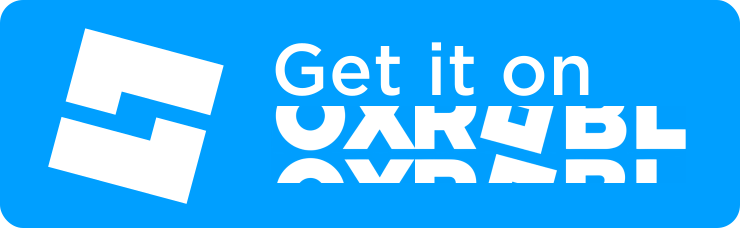

# Info

There are many times when I need icons for my games. So I make them but never give them out but I felt like open-sourcing all of these icons

**Also, you might be able to use this as a CDC**

**I never made itch.io icon, it can be found [here](https://itch.io/press-kit)**

# Preview

    
    

